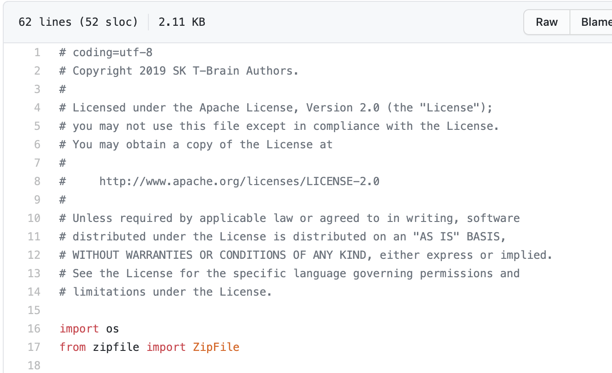
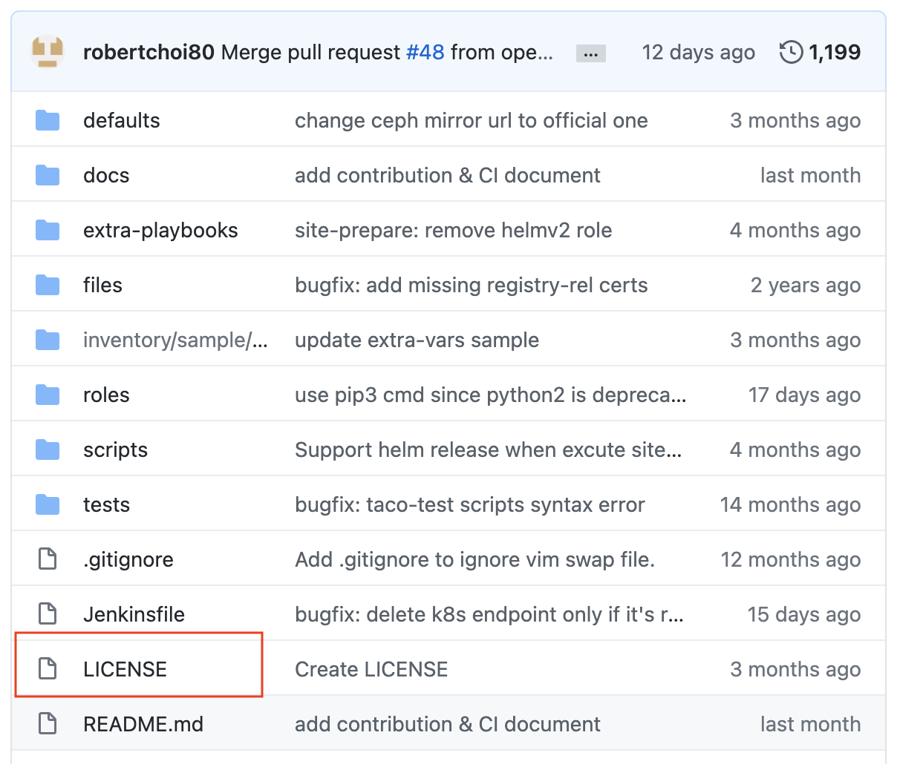

여러가지 방법으로 오픈소스 라이선스를 확인할 수 있다. 분석도구를 사용하지 않고도 확인할 수 있다. 

## 방법 1. 소스 코드 파일 상단 주석 확인
일반적인 오픈소스는 소스 코드 파일 상단에 저작권과 라이선스 정보가 표시한다. 

(https://github.com/SKTBrain/KoBERT/blob/master/kobert/pytorch_kobert.py) 

이 내용으로 오픈소스 라이선스를 확인할 수 있다. 

SK텔레콤은 [fossology](https://tde.sktelecom.com/wiki/display/OSP/fossology)라는 도구를 제공하여 누구나 소스 코드 파일 상단의 오픈소스 라이선스를 쉽게 확인할 수 있게 하였다.

## 방법 2. Root 폴더 내 LICENSE (혹은 COPYING) 파일 확인
일반적인 오픈소스는 Root 폴더 내 LICENSE 혹은 COPYING 파일로 라이선스 정보를 표시한다. 

(https://github.com/openinfradev/tacoplay)

## 방법 3. README 또는 웹사이트에서 라이선스 정보 확인
어떤 오픈소스는 오픈소스를 설명하는 README나 웹사이트 문서에서 라이선스 정보를 제공한다. 

(https://github.com/metatron-app/metatron-discovery)

이상의 정보를 통해 오픈소스의 라이선스 정보를 확인할 수 있다.

만약, 방법 1-3에서 명시한 정보가 서로 상이하다면, 방법 1, 즉, 파일 내 표시된 라이선스 정보에 우선순위를 두고 판단하라. 
